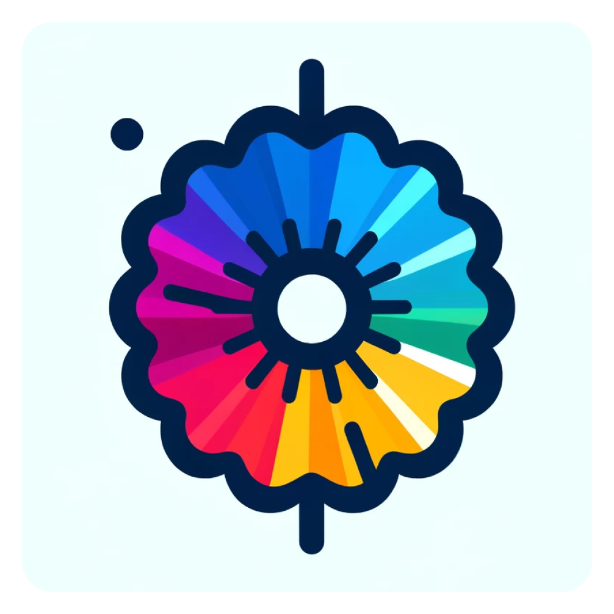

  <h1>Color Scale</h1>
  

Color Scale is a project that allows you to create color scales with a few clicks. You can choose the color you want and the project will generate a color scale from the color you chose.
